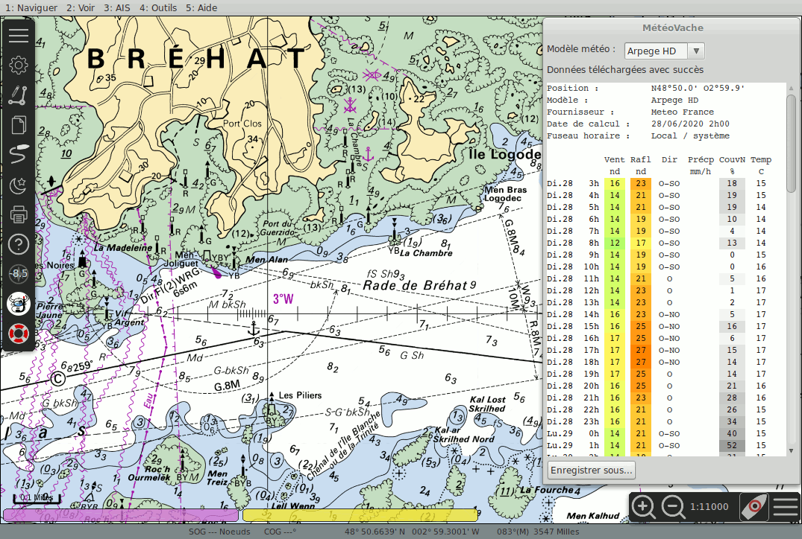

# MeteoVache plug-in for OpenCPN

*MeteoVache* (a.k.a *meteovache_pi*) is a small weather plug-in for *OpenCPN*. It provides weather forecasts anywhere in the World as long as you have an Internet connection.

## Description

*MeteoVache* provides weather forecasts based on the following meteorological models :

- "Arome" : high resolution model (0.05°) from [Météo France](http://www.meteofrance.com) (Coverage : France)
- "Arome Antilles" : high resolution model (0.05°) from [Météo France](http://www.meteofrance.com) (Coverage : Antilles)
- "Arome Océan Indien" : high resolution model (0.05°) from [Météo France](http://www.meteofrance.com) (Coverage : Indian Océan)
- "Arome Guyane" : high resolution model (0.05°) from [Météo France](http://www.meteofrance.com) (Coverage : Guyana)
- "Arome Nouvelle Calédonie" : high resolution model (0.05°) from [Météo France](http://www.meteofrance.com) (Coverage : New Calédonia)
- "Arome Polynésie" : high resolution model (0.05°) from [Météo France](http://www.meteofrance.com) (Coverage : French Polynésia)
- "Icon D2" : high resolution model (0.02°) from [Deutscher Wetterdienst](https://www.dwd.de/EN) (Coverage : Germany)
- "Arpege HD" : regional model (0.1°) from [Météo France](http://www.meteofrance.com) (Coverage : Europe)
- "Icon Eu" : regional model (0.125°) from [Deutscher Wetterdienst](https://www.dwd.de/EN) (Coverage : Europe)
- "Arpege" : global model (0.25°) from [Météo France](http://www.meteofrance.com) (Coverage : World)

*MeteoVache* needs an Internet connection to retrieve weather data from *MeteoVache* server. It has been specifically designed to minimize the amount of data required to get a forecast at a given location. A typical request weights between 500 and 1500 bytes, making it suitable for very low bandwidth Internet connections like Edge GSM.

## Author

* **Ronan Demoment** - [Rodemfr](https://github.com/Rodemfr)

## License

This program is distributed under the terms of the GPL v2. - see the [gpl.txt](cmake/gpl.txt) file for details

## Download

Since v1.1, *MeteoVache* switched to *OpenCPN*'s *managed plugin scheme* which allow you to download it directly from *OpenCPN* GUI. Just go to the *plugin settings* page and download the master catalog. Meteovache should be in if your platform is supported.

## Acknowledgments

* Thanks to @OpenCPN team for providing a comprehensive set of templates and examples to develop plug-ins and to maintain this wonderful Open Source application.

## Release history

**v1.6.4**
* Fixed possible infinite wait in socket read loop

**v1.6.0**
* Fixed crash when using MeteoVache just after having updated it from catalog

**v1.5.4**
* Add possibility to use non graphical wind arrows in weather reports
* Remove commit hash from plugin version in plugin manager
* Fixed DNS failure on some machines

**v1.3.7**
* Fixed translations issues with preference panel
* Improved thread handling

**v1.2**
* Fixed wxWidgets warnings
* Updated MacOS build errors
* Updated CI templates from shipdriver_pi

**v1.1**
* Support for *OpenCPN*'s managed plugin scheme
* Added Spanish & Italian translations
* Handles wxWidgets 3.2 and hi-DPI displays
* Support for dark color themes
* Fixed crash on exit
* Other minor bugfixes

**v0.8**
* Wind direction is now display with nice graphical arrows
* Recompiled against OpenCPN 5.2.4 to fix "small font issue" in contextual menu

**v0.7**
* Weather report is now using colors for better readability
* Cmake files are now arm64 compatible
* Minor bug fixes

**v0.5.2**
* Added an option to remove plug-in icon from tool-bar
* Minor translation fixes

**v0.5**
* Fixed issues in networking thread in case of long server response
* Added a status test in report window to inform on the status of the last forecast request (success, on-going, failed)
* Fixed bad background color in case of dark theme under Debian
* Added display of time zone in weather report
* Added possibility to select select locale/system time zone or UTC in preference dialog

**v0.4**
* Added a button to manually save weather forecast in a text file (normal or column format)
* Added options in the preference panel to enable automatic save of requested forecast (normal, column, with or without ZIP compression)
* Added experimental ARMHF build for Raspberry PI (untested, may not work at all)

**v0.3**
* Added a preference panel with the possibility to change display units
* Fixed negative temperature bug
* Plug-in now compiles stand-alone
* Windows installer is now generated
* On server side : added Arpege model with world wide coverage

**v0.2.1**
* First binary release for Windows x86 and Linux x64

