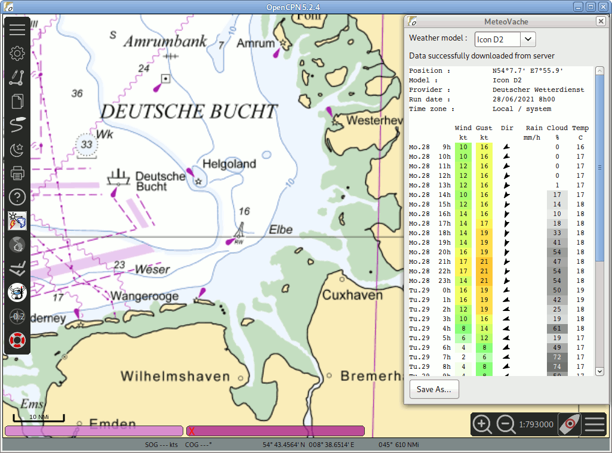

# MeteoVache plugin for OpenCPN

meteovache_pi is a small weather plugin for OpenCPN. It provides weather forecasts anywhere in Europe as long as you have an internet connection.
MeteoVache has been especially designed to be useable with very low bandwidth connections. It runs fine and fast with only a few kilobits per second.

## Description

meteovache_pi is a plugin for OpenCPN which provides weather forecast from a number of meteorological forecast models :

- "AROME" : local model (0.05°) from [Météo France](http://www.meteofrance.com) (Coverage : France)
- "ARPEGE HD" : global model (0.1°) from [Météo France](http://www.meteofrance.com) (Coverage : Europe)
- "ICON EU" : global model (0.125°) from [Deutscher Wetterdienst](https://www.dwd.de/EN) (Coverage Europe)

meteovache_pi needs a internet connection to retreive weather data from MeteoVache server. It has been especially designed to minimize the amount of data required to get a forecast at a given location. A typical request weights between 1 and 1.5kb, making it suitable for very low bandwidth internet connections like Edge GSM.

Current coverage is limited to Europe, but the entire world should come in a few weeks...

## Author

* **Ronan Demoment** - [Rodemfr](https://github.com/Rodemfr)

## License

This program is distributed under the terms of the GPL v2. - see the [gpl.txt](cmake/gpl.txt) file for details

## Download binary releases

Latest release is v0.2.1. Here are the binaries for OpenCPN 5.0 :

- Win32 x86 : [meteovache_pi_v0.2.1_ocpn50_win32_x86.zip](https://github.com/Rodemfr/meteovache_pi/raw/master/files/binaries/opencpn50/win32_x86/meteovache_pi_v0.2.1_ocpn50_win32_x86.zip)
- Linux x64 : [meteovache_pi_v0.2.1_opcn50_linux_x86.tar.gz](https://github.com/Rodemfr/meteovache_pi/raw/master/files/binaries/opencpn50/linux_x64/meteovache_pi_v0.2.1_opcn50_linux_x86.tar.gz)

Installers are not available at this time. You will have to uncompress archives yourself and to copy the various files in OpenCPN install directory. Archives have been made in such a way that the folder structure inside OpenCPN install directory is preserved.

Other platforms (OSX and ARM/RPi) will come soon.

## Acknowledgments

* Thanks to @OpenCPN team for providing a comprehensive set of templates and examples to develop plugins

